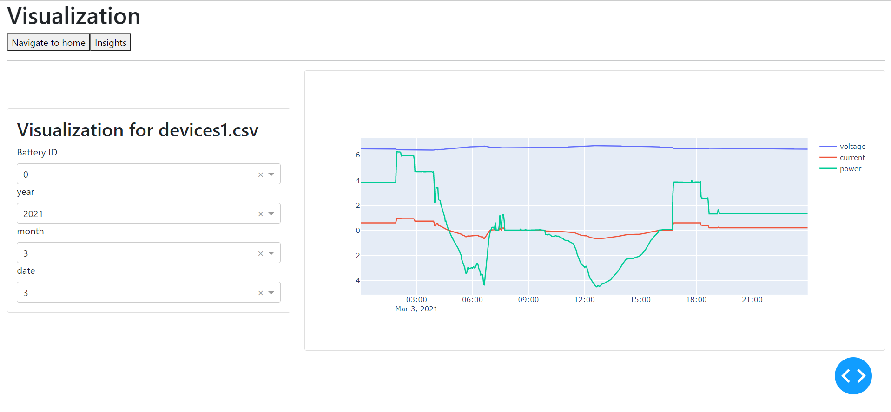

# Wiki
This is the visualization app from Nishank Navelkar for Battery.DEV 2022 Challenge II - BBOX Field Data
Our team includes Yannick Kuhn, Srinath Kannou, Nishank Navelkar and Zihao Zhou

## visualize data from the raw files
- Set up a virtual environment using the command `conda env create --file environment.yml` .

- Make sure all the packages from requirements.txt are installed in the virtual environment.
  
- run command `python app.py` 
  
- It might take some time for the server to start, to visualize the data open the link on your browser `http://localhost:8050/` (If the page does not load, reload the page multiple times)

- Select the values from dropdown menu and visualize the parameters.

## Description of the App
The app is divided into two parts
- Visualization
- Insights(Not complete)

Characteristics of cell such as voltage, current and power can be interactively visualized, the data is split in 1 day increements. 
Future plan is to add insights about the cell such as power consumed by load, energy put in battery during charging, SOC and SOH measurements, performance of battery, cell degradation and usage profiles.

## Approach towards the problem
In order to understand usage profiles, it is necessary that we have a intuitive understaning of the usage of the battery packs. Hence having a tool which can help us visualize the usage of a battery pack at any point of time is necessary. This app is my attempt towards solving the above problem.

## Interface

## References
- Theme: [bootstrap theme](https://dash-bootstrap-components.opensource.faculty.ai/examples/iris/)
- Dash: [Dash](https://dash.plotly.com/)